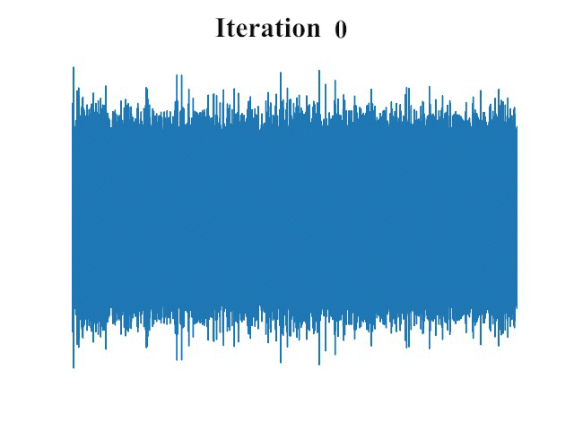

{:.no_toc}
* toc
{:toc}

# Abstract
Denoising diffusion probabilistic models (DDPMs) have recently achieved leading performances in many generative tasks. However, the inherited iterative sampling process costs hindered their applications to speech synthesis. This paper proposes FastDiff, a fast conditional diffusion model for high-quality speech synthesis. FastDiff employs a stack of time-aware location-variable convolutions of diverse receptive field patterns to efficiently model long-term time dependencies with adaptive conditions. A noise schedule predictor is also adopted to reduce the sampling steps without sacrificing the generation quality. Based on FastDiff, we design an end-to-end text-to-speech synthesizer, FastDiff-TTS, which generates high-fidelity speech waveforms without any intermediate feature (e.g., Mel-spectrogram). Our evaluation of FastDiff demonstrates the state-of-the-art results with higher-quality (MOS 4.28) speech samples. Also, FastDiff enables a sampling speed of 58x faster than real-time on a V100 GPU, making diffusion models practically applicable to speech synthesis deployment for the first time. We further show that FastDiff generalized well to the mel-spectrogram inversion of unseen speakers, and FastDiff-TTS outperformed other competing methods in end-to-end text-to-speech synthesis.

{: width="50%"}{: .center}  

# Single Speaker (LJSpeech Dataset)
<table>
            <thead>
            <th style="text-align: center">Utterance</th>
            <th style="text-align: center">GT</th>
            <th style="text-align: center">WaveNet</th>
            <th style="text-align: center">WaveGlow</th>
            <th style="text-align: center">HIFI-GAN</th>
            <th style="text-align: center">UnivNet</th>
            <th style="text-align: center">Diffwave(6)</th>
            <th style="text-align: center">WaveGrad(50)</th>
            <th style="text-align: center">FastDiff(4)</th> 
            </thead>
            <tbody>
                <tr>
                    <th>#1</th>
                    <td style="text-align: center"><audio controls style="width: 150px;"><source src="wavs/Vocoder/GT/[LJ001-0001].wav" type="audio/wav"></audio></td>
                    <td style="text-align: center"><audio controls style="width: 150px;"><source src="wavs/Vocoder/WaveNet/LJ001-0001.wav" type="audio/wav"></audio></td>
                    <td style="text-align: center"><audio controls style="width: 150px;"><source src="wavs/Vocoder/WaveGlow/LJ001-0001.wav_synthesis.wav" type="audio/wav"></audio></td>
                    <td style="text-align: center"><audio controls style="width: 150px;"><source src="wavs/Vocoder/HIFIGAN/LJ001-0001_generated.wav" type="audio/wav"></audio></td>
                    <td style="text-align: center"><audio controls style="width: 150px;"><source src="wavs/Vocoder/UnivNet/LJ001-0001_reconstructed.wav" type="audio/wav"></audio></td>
                    <td style="text-align: center"><audio controls style="width: 150px;"><source src="wavs/Vocoder/Diffwave/LJ001-0001_6.wav" type="audio/wav"></audio></td>
                    <td style="text-align: center"><audio controls style="width: 150px;"><source src="wavs/Vocoder/WaveGrad/predicted_LJ001-0001.wav" type="audio/wav"></audio></td>
                    <td style="text-align: center"><audio controls style="width: 150px;"><source src="wavs/Vocoder/FastDiff/LJ001-0001_pred.wav" type="audio/wav"></audio></td>
                </tr>
            </tbody>
            <tbody>
                <tr>
                    <th>#2</th>
                    <td style="text-align: center"><audio controls style="width: 150px;"><source src="wavs/Vocoder/GT/[LJ001-0002].wav" type="audio/wav"></audio></td>
                    <td style="text-align: center"><audio controls style="width: 150px;"><source src="wavs/Vocoder/WaveNet/LJ001-0002.wav" type="audio/wav"></audio></td>
                    <td style="text-align: center"><audio controls style="width: 150px;"><source src="wavs/Vocoder/WaveGlow/LJ001-0002.wav_synthesis.wav" type="audio/wav"></audio></td>
                    <td style="text-align: center"><audio controls style="width: 150px;"><source src="wavs/Vocoder/HIFIGAN/LJ001-0002_generated.wav" type="audio/wav"></audio></td>
                    <td style="text-align: center"><audio controls style="width: 150px;"><source src="wavs/Vocoder/UnivNet/LJ001-0002_reconstructed.wav" type="audio/wav"></audio></td>
                    <td style="text-align: center"><audio controls style="width: 150px;"><source src="wavs/Vocoder/Diffwave/LJ001-0002_6.wav" type="audio/wav"></audio></td>
                    <td style="text-align: center"><audio controls style="width: 150px;"><source src="wavs/Vocoder/WaveGrad/predicted_LJ001-0002.wav" type="audio/wav"></audio></td>
                    <td style="text-align: center"><audio controls style="width: 150px;"><source src="wavs/Vocoder/FastDiff/LJ001-0002_pred.wav" type="audio/wav"></audio></td>
                </tr>
            </tbody>
            <tbody>
                <tr>
                    <th>#3</th>
                    <td style="text-align: center"><audio controls style="width: 150px;"><source src="wavs/Vocoder/GT/[LJ001-0003].wav" type="audio/wav"></audio></td>
                    <td style="text-align: center"><audio controls style="width: 150px;"><source src="wavs/Vocoder/WaveNet/LJ001-0003.wav" type="audio/wav"></audio></td>
                    <td style="text-align: center"><audio controls style="width: 150px;"><source src="wavs/Vocoder/WaveGlow/LJ001-0003.wav_synthesis.wav" type="audio/wav"></audio></td>
                    <td style="text-align: center"><audio controls style="width: 150px;"><source src="wavs/Vocoder/HIFIGAN/LJ001-0003_generated.wav" type="audio/wav"></audio></td>
                    <td style="text-align: center"><audio controls style="width: 150px;"><source src="wavs/Vocoder/UnivNet/LJ001-0003_reconstructed.wav" type="audio/wav"></audio></td>
                    <td style="text-align: center"><audio controls style="width: 150px;"><source src="wavs/Vocoder/Diffwave/LJ001-0003_6.wav" type="audio/wav"></audio></td>
                    <td style="text-align: center"><audio controls style="width: 150px;"><source src="wavs/Vocoder/WaveGrad/predicted_LJ001-0003.wav" type="audio/wav"></audio></td>
                    <td style="text-align: center"><audio controls style="width: 150px;"><source src="wavs/Vocoder/FastDiff/LJ001-0003_pred.wav" type="audio/wav"></audio></td>
                </tr>
            </tbody>
                <tbody>
                <tr>
                    <th>#4</th>
                    <td style="text-align: center"><audio controls style="width: 150px;"><source src="wavs/Vocoder/GT/[LJ001-0004].wav" type="audio/wav"></audio></td>
                    <td style="text-align: center"><audio controls style="width: 150px;"><source src="wavs/Vocoder/WaveNet/LJ001-0004.wav" type="audio/wav"></audio></td>
                    <td style="text-align: center"><audio controls style="width: 150px;"><source src="wavs/Vocoder/WaveGlow/LJ001-0004.wav_synthesis.wav" type="audio/wav"></audio></td>
                    <td style="text-align: center"><audio controls style="width: 150px;"><source src="wavs/Vocoder/HIFIGAN/LJ001-0004_generated.wav" type="audio/wav"></audio></td>
                    <td style="text-align: center"><audio controls style="width: 150px;"><source src="wavs/Vocoder/UnivNet/LJ001-0004_reconstructed.wav" type="audio/wav"></audio></td>
                    <td style="text-align: center"><audio controls style="width: 150px;"><source src="wavs/Vocoder/Diffwave/LJ001-0004_6.wav" type="audio/wav"></audio></td>
                    <td style="text-align: center"><audio controls style="width: 150px;"><source src="wavs/Vocoder/WaveGrad/predicted_LJ001-0004.wav" type="audio/wav"></audio></td>
                    <td style="text-align: center"><audio controls style="width: 150px;"><source src="wavs/Vocoder/FastDiff/LJ001-0004_pred.wav" type="audio/wav"></audio></td>
                </tr>
            </tbody>
            <tbody>
                <tr>
                    <th>#5</th>
                    <td style="text-align: center"><audio controls style="width: 150px;"><source src="wavs/Vocoder/GT/[LJ001-0005].wav" type="audio/wav"></audio></td>
                    <td style="text-align: center"><audio controls style="width: 150px;"><source src="wavs/Vocoder/WaveNet/LJ001-0005.wav" type="audio/wav"></audio></td>
                    <td style="text-align: center"><audio controls style="width: 150px;"><source src="wavs/Vocoder/WaveGlow/LJ001-0005.wav_synthesis.wav" type="audio/wav"></audio></td>
                    <td style="text-align: center"><audio controls style="width: 150px;"><source src="wavs/Vocoder/HIFIGAN/LJ001-0005_generated.wav" type="audio/wav"></audio></td>
                    <td style="text-align: center"><audio controls style="width: 150px;"><source src="wavs/Vocoder/UnivNet/LJ001-0005_reconstructed.wav" type="audio/wav"></audio></td>
                    <td style="text-align: center"><audio controls style="width: 150px;"><source src="wavs/Vocoder/Diffwave/LJ001-0005_6.wav" type="audio/wav"></audio></td>
                    <td style="text-align: center"><audio controls style="width: 150px;"><source src="wavs/Vocoder/WaveGrad/predicted_LJ001-0005.wav" type="audio/wav"></audio></td>
                    <td style="text-align: center"><audio controls style="width: 150px;"><source src="wavs/Vocoder/FastDiff/LJ001-0005_pred.wav" type="audio/wav"></audio></td>
                </tr>
            </tbody>
    </table>

# Unseen Speakers (VCTK Dataset)
<table>
            <thead>
            <th style="text-align: center">Utterance</th>
            <th style="text-align: center">GT</th>
            <th style="text-align: center">WaveNet</th>
            <th style="text-align: center">WaveGlow</th>
            <th style="text-align: center">HIFI-GAN</th>
            <th style="text-align: center">UnivNet</th>
            <th style="text-align: center">Diffwave(6)</th>
            <th style="text-align: center">WaveGrad(50)</th>
            <th style="text-align: center">FastDiff(4)</th> 
            </thead>
            <tbody>
                <tr>
                    <th>#1</th>
                    <td style="text-align: center"><audio controls style="width: 150px;"><source src="wavs/Generalize/GT/[p225_002].wav" type="audio/wav"></audio></td>
                    <td style="text-align: center"><audio controls style="width: 150px;"><source src="wavs/Generalize/WaveNet/p225_002.wav" type="audio/wav"></audio></td>
                    <td style="text-align: center"><audio controls style="width: 150px;"><source src="wavs/Generalize/WaveGlow/p225_002.wav_synthesis.wav" type="audio/wav"></audio></td>
                    <td style="text-align: center"><audio controls style="width: 150px;"><source src="wavs/Generalize/HIFIGAN/p225_002_generated.wav" type="audio/wav"></audio></td>
                    <td style="text-align: center"><audio controls style="width: 150px;"><source src="wavs/Generalize/UnivNet/p225_002_reconstructed.wav" type="audio/wav"></audio></td>
                    <td style="text-align: center"><audio controls style="width: 150px;"><source src="wavs/Generalize/Diffwave/p225_002_6.wav" type="audio/wav"></audio></td>
                    <td style="text-align: center"><audio controls style="width: 150px;"><source src="wavs/Generalize/WaveGrad/predicted_p225_002.wav" type="audio/wav"></audio></td>
                    <td style="text-align: center"><audio controls style="width: 150px;"><source src="wavs/Generalize/FastDiff/p225_002.wav_pred.wav" type="audio/wav"></audio></td>
                </tr>
            </tbody>
            <tbody>
                <tr>
                    <th>#2</th>
                    <td style="text-align: center"><audio controls style="width: 150px;"><source src="wavs/Generalize/GT/[p226_001].wav" type="audio/wav"></audio></td>
                    <td style="text-align: center"><audio controls style="width: 150px;"><source src="wavs/Generalize/WaveNet/p226_001.wav" type="audio/wav"></audio></td>
                    <td style="text-align: center"><audio controls style="width: 150px;"><source src="wavs/Generalize/WaveGlow/p226_001.wav_synthesis.wav" type="audio/wav"></audio></td>
                    <td style="text-align: center"><audio controls style="width: 150px;"><source src="wavs/Generalize/HIFIGAN/p226_001_generated.wav" type="audio/wav"></audio></td>
                    <td style="text-align: center"><audio controls style="width: 150px;"><source src="wavs/Generalize/UnivNet/p226_001_reconstructed.wav" type="audio/wav"></audio></td>
                    <td style="text-align: center"><audio controls style="width: 150px;"><source src="wavs/Generalize/Diffwave/p226_001_6.wav" type="audio/wav"></audio></td>
                    <td style="text-align: center"><audio controls style="width: 150px;"><source src="wavs/Generalize/WaveGrad/predicted_p226_001.wav" type="audio/wav"></audio></td>
                    <td style="text-align: center"><audio controls style="width: 150px;"><source src="wavs/Generalize/FastDiff/p226_001.wav_pred.wav" type="audio/wav"></audio></td>
                </tr>
            </tbody>
            <tbody>
               <tr>
                  <th>#3</th>
                  <td style="text-align: center"><audio controls style="width: 150px;"><source src="wavs/Generalize/GT/[p228_002].wav" type="audio/wav"></audio></td>
                  <td style="text-align: center"><audio controls style="width: 150px;"><source src="wavs/Generalize/WaveNet/p228_002.wav" type="audio/wav"></audio></td>
                  <td style="text-align: center"><audio controls style="width: 150px;"><source src="wavs/Generalize/WaveGlow/p228_002.wav_synthesis.wav" type="audio/wav"></audio></td>
                  <td style="text-align: center"><audio controls style="width: 150px;"><source src="wavs/Generalize/HIFIGAN/p228_002_generated.wav" type="audio/wav"></audio></td>
                  <td style="text-align: center"><audio controls style="width: 150px;"><source src="wavs/Generalize/UnivNet/p228_002_reconstructed.wav" type="audio/wav"></audio></td>
                  <td style="text-align: center"><audio controls style="width: 150px;"><source src="wavs/Generalize/Diffwave/p228_002_6.wav" type="audio/wav"></audio></td>
                  <td style="text-align: center"><audio controls style="width: 150px;"><source src="wavs/Generalize/WaveGrad/predicted_p228_002.wav" type="audio/wav"></audio></td>
                  <td style="text-align: center"><audio controls style="width: 150px;"><source src="wavs/Generalize/FastDiff/p228_002.wav_pred.wav" type="audio/wav"></audio></td>
              </tr>
            </tbody>
                <tbody>
                <tr>
                    <th>#4</th>
                    <td style="text-align: center"><audio controls style="width: 150px;"><source src="wavs/Generalize/GT/[p227_001].wav" type="audio/wav"></audio></td>
                    <td style="text-align: center"><audio controls style="width: 150px;"><source src="wavs/Generalize/WaveNet/p227_001.wav" type="audio/wav"></audio></td>
                    <td style="text-align: center"><audio controls style="width: 150px;"><source src="wavs/Generalize/WaveGlow/p227_001.wav_synthesis.wav" type="audio/wav"></audio></td>
                    <td style="text-align: center"><audio controls style="width: 150px;"><source src="wavs/Generalize/HIFIGAN/p227_001_generated.wav" type="audio/wav"></audio></td>
                    <td style="text-align: center"><audio controls style="width: 150px;"><source src="wavs/Generalize/UnivNet/p227_001_reconstructed.wav" type="audio/wav"></audio></td>
                    <td style="text-align: center"><audio controls style="width: 150px;"><source src="wavs/Generalize/Diffwave/p227_001_6.wav" type="audio/wav"></audio></td>
                    <td style="text-align: center"><audio controls style="width: 150px;"><source src="wavs/Generalize/WaveGrad/predicted_p227_001.wav" type="audio/wav"></audio></td>
                    <td style="text-align: center"><audio controls style="width: 150px;"><source src="wavs/Generalize/FastDiff/p227_001.wav_pred.wav" type="audio/wav"></audio></td>
                </tr>
            </tbody>
            <tbody>
                <tr>
                    <th>#5</th>
                    <td style="text-align: center"><audio controls style="width: 150px;"><source src="wavs/Generalize/GT/[p229_001].wav" type="audio/wav"></audio></td>
                    <td style="text-align: center"><audio controls style="width: 150px;"><source src="wavs/Generalize/WaveNet/p229_001.wav" type="audio/wav"></audio></td>
                    <td style="text-align: center"><audio controls style="width: 150px;"><source src="wavs/Generalize/WaveGlow/p229_001.wav_synthesis.wav" type="audio/wav"></audio></td>
                    <td style="text-align: center"><audio controls style="width: 150px;"><source src="wavs/Generalize/HIFIGAN/p229_001_generated.wav" type="audio/wav"></audio></td>
                    <td style="text-align: center"><audio controls style="width: 150px;"><source src="wavs/Generalize/UnivNet/p229_001_reconstructed.wav" type="audio/wav"></audio></td>
                    <td style="text-align: center"><audio controls style="width: 150px;"><source src="wavs/Generalize/Diffwave/p229_001_6.wav" type="audio/wav"></audio></td>
                    <td style="text-align: center"><audio controls style="width: 150px;"><source src="wavs/Generalize/WaveGrad/predicted_p229_001.wav" type="audio/wav"></audio></td>
                    <td style="text-align: center"><audio controls style="width: 150px;"><source src="wavs/Generalize/FastDiff/p229_001.wav_pred.wav" type="audio/wav"></audio></td>
                </tr>
            </tbody>
        </table>

# End-to-End Text-to-Speech

<ruby>he commission believes, however</ruby>
<table>
	<thead>
		<tr>
			<th style="text-align: center">GT</th>
            <th style="text-align: center">GT (voc.)</th>
			<th style="text-align: center">Cascaded</th>
            <th style="text-align: center">FastSpeech 2s</th>
            <th style="text-align: center">WaveGrad</th>
			<th style="text-align: center">FastDiff-TTS</th>
		</tr>
	</thead>
	<tbody>
		<tr>
			<td style="text-align: center"><audio controls style="width: 150px;"><source src="wavs/E2ETTS/GT_1.wav" type="audio/wav"></audio></td>
			<td style="text-align: center"><audio controls style="width: 150px;"><source src="wavs/E2ETTS/GT_voc_1.wav" type="audio/wav"></audio></td>
            <td style="text-align: center"><audio controls style="width: 150px;"><source src="wavs/E2ETTS/Cascaded_1.wav" type="audio/wav"></audio></td>
			<td style="text-align: center"><audio controls style="width: 150px;"><source src="wavs/E2ETTS/FastSpeech2s_1.wav" type="audio/wav"></audio></td>
			<td style="text-align: center"><audio controls style="width: 150px;"><source src="wavs/E2ETTS/WaveGrad_1.wav" type="audio/wav"></audio></td>
            <td style="text-align: center"><audio controls style="width: 150px;"><source src="wavs/E2ETTS/FastDiff_TTS_1.wav" type="audio/wav"></audio></td>
		</tr>
	</tbody>
</table>

<ruby>the commission has the impression</ruby>
<table>
	<thead>
		<tr>
			<th style="text-align: center">GT</th>
            <th style="text-align: center">GT (voc.)</th>
			<th style="text-align: center">Cascaded</th>
            <th style="text-align: center">FastSpeech 2s</th>
            <th style="text-align: center">WaveGrad</th>
			<th style="text-align: center">FastDiff-TTS</th>
		</tr>
	</thead>
	<tbody>
		<tr>
			<td style="text-align: center"><audio controls style="width: 150px;"><source src="wavs/E2ETTS/GT_2.wav" type="audio/wav"></audio></td>
			<td style="text-align: center"><audio controls style="width: 150px;"><source src="wavs/E2ETTS/GT_voc_2.wav" type="audio/wav"></audio></td>
            <td style="text-align: center"><audio controls style="width: 150px;"><source src="wavs/E2ETTS/Cascaded_2.wav" type="audio/wav"></audio></td>
			<td style="text-align: center"><audio controls style="width: 150px;"><source src="wavs/E2ETTS/FastSpeech2s_2.wav" type="audio/wav"></audio></td>
			<td style="text-align: center"><audio controls style="width: 150px;"><source src="wavs/E2ETTS/WaveGrad_2.wav" type="audio/wav"></audio></td>
            <td style="text-align: center"><audio controls style="width: 150px;"><source src="wavs/E2ETTS/FastDiff_TTS_2.wav" type="audio/wav"></audio></td>
		</tr>
	</tbody>
</table>
